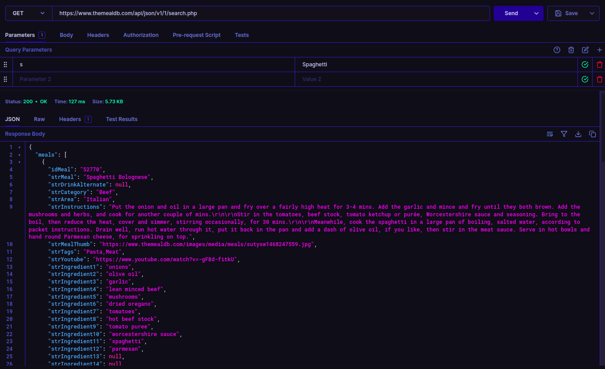
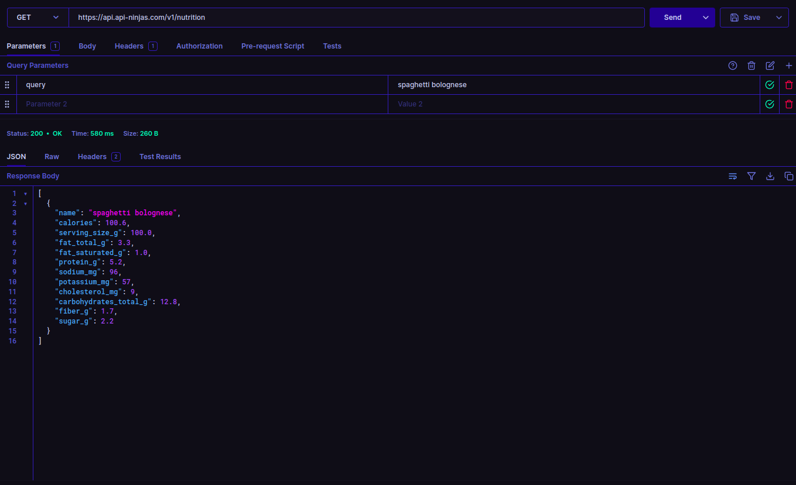

# CSC207 Group Project

## Members

<!-- TODO: fill in names here -->

## Problem Domain

- Nutrition app with meals

## Application Description

- Accounts for each user
    - Store favourite recipes
- Allow searching of recipes
    - Provide recipe, and nutritional information of item

## API We Can Use

- For recipes, make use of TheMealDB API [link](https://themealdb.com/api.php)
- For nutritional information, can make use of [this nutrition API](https://api-ninjas.com/api/nutrition)





## Example Output From Java

```
Response{protocol=h2, code=200, message=, url=https://www.themealdb.com/api/json/v1/1/search.php?s=Spaghetti}
{"meals":[{"strImageSource":null,"strIngredient10":"worcestershire sauce","strIngredient12":"parmesan","strIngredient11":"spaghetti","strIngredient14":null,"strCategory":"Beef","strIngredient13":null,"strIngredient16":null,"strIngredient15":null,"strIngredient18":null,"strIngredient17":null,"strArea":"Italian","strCreativeCommonsConfirmed":null,"strIngredient19":null,"strTags":"Pasta,Meat","idMeal":"52770","strInstructions":"Put the onion and oil in a large pan and fry over a fairly high heat for 3-4 mins. Add the garlic and mince and fry until they both brown. Add the mushrooms and herbs, and cook for another couple of mins.\r\n\r\nStir in the tomatoes, beef stock, tomato ketchup or purée, Worcestershire sauce and seasoning. Bring to the boil, then reduce the heat, cover and simmer, stirring occasionally, for 30 mins.\r\n\r\nMeanwhile, cook the spaghetti in a large pan of boiling, salted water, according to packet instructions. Drain well, run hot water through it, put it back in the pan and add a dash of olive oil, if you like, then stir in the meat sauce. Serve in hot bowls and hand round Parmesan cheese, for sprinkling on top.","strIngredient1":"onions","strIngredient3":"garlic","strIngredient2":"olive oil","strIngredient20":null,"strIngredient5":"mushrooms","strIngredient4":"lean minced beef","strIngredient7":"tomatoes","strIngredient6":"dried oregano","strIngredient9":"tomato puree","strIngredient8":"hot beef stock","strMealThumb":"https://www.themealdb.com/images/media/meals/sutysw1468247559.jpg","strMeasure20":null,"strYoutube":"https://www.youtube.com/watch?v=-gF8d-fitkU","strMeal":"Spaghetti Bolognese","strMeasure12":"Topping","strMeasure13":"","strMeasure10":"1tbsp","strMeasure11":"350g","dateModified":null,"strDrinkAlternate":null,"strSource":null,"strMeasure9":"1tbsp","strMeasure7":"400g can","strMeasure8":"300ml","strMeasure5":"90g","strMeasure6":"1tsp","strMeasure3":"1 clove","strMeasure4":"500g","strMeasure1":"2","strMeasure18":null,"strMeasure2":"1tbsp","strMeasure19":null,"strMeasure16":null,"strMeasure17":null,"strMeasure14":"","strMeasure15":""},{"strImageSource":null,"strIngredient10":"","strIngredient12":"","strIngredient11":"","strIngredient14":"","strCategory":"Pasta","strIngredient13":"","strIngredient16":"","strIngredient15":"","strIngredient18":"","strIngredient17":"","strArea":"Italian","strCreativeCommonsConfirmed":null,"strIngredient19":"","strTags":"Pasta,BBQ,Breakfast","idMeal":"52982","strInstructions":"STEP 1\r\nPut a large saucepan of water on to boil.\r\n\r\nSTEP 2\r\nFinely chop the 100g pancetta, having first removed any rind. Finely grate 50g pecorino cheese and 50g parmesan and mix them together.\r\n\r\nSTEP 3\r\nBeat the 3 large eggs in a medium bowl and season with a little freshly grated black pepper. Set everything aside.\r\n\r\nSTEP 4\r\nAdd 1 tsp salt to the boiling water, add 350g spaghetti and when the water comes back to the boil, cook at a constant simmer, covered, for 10 minutes or until al dente (just cooked).\r\n\r\nSTEP 5\r\nSquash 2 peeled plump garlic cloves with the blade of a knife, just to bruise it.\r\n\r\nSTEP 6\r\nWhile the spaghetti is cooking, fry the pancetta with the garlic. Drop 50g unsalted butter into a large frying pan or wok and, as soon as the butter has melted, tip in the pancetta and garlic.\r\n\r\nSTEP 7\r\nLeave to cook on a medium heat for about 5 minutes, stirring often, until the pancetta is golden and crisp. The garlic has now imparted its flavour, so take it out with a slotted spoon and discard.\r\n\r\nSTEP 8\r\nKeep the heat under the pancetta on low. When the pasta is ready, lift it from the water with a pasta fork or tongs and put it in the frying pan with the pancetta. Don\u2019t worry if a little water drops in the pan as well (you want this to happen) and don\u2019t throw the pasta water away yet.\r\n\r\nSTEP 9\r\nMix most of the cheese in with the eggs, keeping a small handful back for sprinkling over later.\r\n\r\nSTEP 10\r\nTake the pan of spaghetti and pancetta off the heat. Now quickly pour in the eggs and cheese. Using the tongs or a long fork, lift up the spaghetti so it mixes easily with the egg mixture, which thickens but doesn\u2019t scramble, and everything is coated.\r\n\r\nSTEP 11\r\nAdd extra pasta cooking water to keep it saucy (several tablespoons should do it). You don\u2019t want it wet, just moist. Season with a little salt, if needed.\r\n\r\nSTEP 12\r\nUse a long-pronged fork to twist the pasta on to the serving plate or bowl. Serve immediately with a little sprinkling of the remaining cheese and a grating of black pepper. If the dish does get a little dry before serving, splash in some more hot pasta water and the glossy sauciness will be revived.","strIngredient1":"Spaghetti","strIngredient3":"Salt","strIngredient2":"Egg Yolks","strIngredient20":"","strIngredient5":"Pecorino","strIngredient4":"Bacon","strIngredient7":"","strIngredient6":"Black Pepper","strIngredient9":"","strIngredient8":"","strMealThumb":"https://www.themealdb.com/images/media/meals/llcbn01574260722.jpg","strMeasure20":" ","strYoutube":"https://www.youtube.com/watch?v=_T6jkRvhlkk","strMeal":"Spaghetti alla Carbonara","strMeasure12":" ","strMeasure13":" ","strMeasure10":" ","strMeasure11":" ","dateModified":null,"strDrinkAlternate":null,"strSource":"https://www.bbcgoodfood.com/recipes/ultimate-spaghetti-carbonara-recipe","strMeasure9":" ","strMeasure7":" ","strMeasure8":" ","strMeasure5":"50g","strMeasure6":"As required","strMeasure3":"As required","strMeasure4":"150g","strMeasure1":"320g","strMeasure18":" ","strMeasure2":"6","strMeasure19":" ","strMeasure16":" ","strMeasure17":" ","strMeasure14":" ","strMeasure15":" "}]}
Response{protocol=h2, code=200, message=, url=https://api.api-ninjas.com/v1/nutrition?query=Spaghetti}
{"sodium_mg":4,"sugar_g":1.1,"fat_total_g":0.6,"cholesterol_mg":0,"protein_g":5.3,"name":"spaghetti","fiber_g":1.3,"calories":154.1,"serving_size_g":100,"fat_saturated_g":0.1,"carbohydrates_total_g":30.6,"potassium_mg":75}
spaghetti
```
